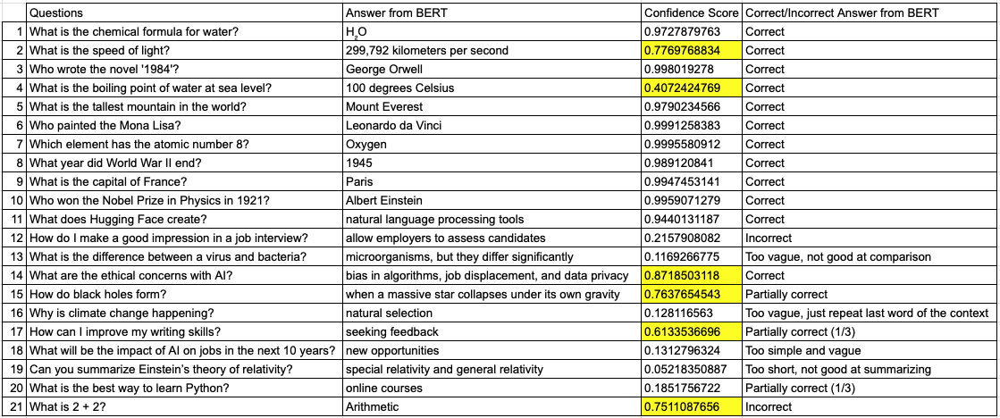

# Part 2

## Introduction and Hypothesis

In this part, I aim to evaluate and compare the performance of BERT and ChatGPT in answering questions. For this purpose, I fine-tune BERT, a model primarily designed for text extraction, using the SQuAD dataset. BERT excels at retrieving precise, factual information from a given context. Its focus on structured knowledge retrieval ensures accurate fact extraction without generating insights beyond the provided content. In contrast, ChatGPT is a generative language model that synthesizes information, offers explanations, and provides nuanced, context-rich answers by leveraging its ability to generate new text and make inferences.

Based on these differences, I hypothesize that:

- **BERT will perform better than ChatGPT** for questions that require precise fact extraction or retrieval of specific details from a given context, as its design prioritizes accuracy in extracting exact answers without unnecessary elaboration. These questions may include:
  - Extraction of dates, names, or numerical data.
  - Factual queries directly answerable from the text.

- **ChatGPT will perform better than BERT** for questions that require interpretation, inference, or synthesis of information beyond what is explicitly stated. ChatGPT’s generative capabilities allow it to offer explanations, draw connections, and elaborate on complex topics. These questions may include:
  - Summarization of complex ideas.
  - Providing actionable advice or guidance.
  - Comparing and contrasting concepts.

To test this hypothesis, I fine-tuned BERT on the SQuAD dataset using Huggingface's implementation and compared its performance on a set of 20 questions. This set is divided into two groups:

1. **Fact extraction questions (10 questions)** - BERT is expected to perform well, while ChatGPT might struggle.
2. **Inference and synthesis questions (10 questions)** - ChatGPT is expected to excel, while BERT may struggle.

I evaluated accuracy using F1 score and Exact Match (EM) and analyzed confidence scores as additional observations. Additionally, I compared my results with responses from ChatGPT to analyze differences and explain these observations.

## Experiment

### Explanation of Results

The table above shows all the questions I asked BERT. The columns include:

1. Question number
2. Questions asked
3. BERT's answer
4. Confidence score of the model
5. Correctness classification (correct, partially correct, or incorrect)

A higher confidence score indicates greater certainty in the correctness of the extracted answer.

#### Observations:

- **Questions 1 to 11:** BERT performed well, while ChatGPT struggled. However, BERT’s confidence scores for Question 2 (0.78) and Question 4 (0.41) were lower than expected due to ambiguity and partial span extraction.
  - *Question 2:* The passage contained two equivalent answers (“299,792 kilometers per second” and “186,282 miles per second”), which diluted confidence scores due to multiple valid spans.
  - *Question 4:* BERT extracted “100 degrees Celsius” instead of the full span “100 degrees Celsius (212 degrees Fahrenheit),” which impacted confidence.

- **Questions 12 to 21:** While I expected BERT to struggle, it performed better than anticipated on some questions.
  - *Question 14:* Asked about ethical concerns in AI, BERT correctly extracted “bias in algorithms, job displacement, and data privacy” with a confidence score of 0.8719. The clear structure of the passage likely contributed to this high confidence.
  - *Question 15:* Despite a confidence score of 0.86, the extracted answer was only partially correct. This highlights a limitation in confidence scores, as they indicate certainty but not completeness.

### Result

#### Accuracy Analysis

The fine-tuned BERT model achieved:
- **F1 Score:** 85.35%
- **Exact Match (EM):** 77.37%

These results indicate strong performance in extracting relevant answer spans. The gap between F1 and EM scores (~7-8%) suggests that while many answers were partially correct, they did not fully align with the ground truth. This aligns with previous observations (e.g., Question 4), where partial span extraction affected accuracy.

#### Confidence Score Observation

Confidence scores provided additional insights:
- **Higher confidence scores** were observed when the passage was well-structured and presented information clearly (e.g., Question 14).
- **Lower confidence scores** were seen when ambiguity or incomplete spans affected prediction accuracy (e.g., Questions 2 and 4).
- Some **discrepancies** occurred where confidence scores were high despite incorrect or partial answers (e.g., Question 15 with 0.86 confidence).

These findings highlight the importance of integrating multiple evaluation metrics beyond confidence scores to comprehensively assess model performance.

---

This README provides an overview of the hypothesis, experiment, results, and key observations from evaluating BERT and ChatGPT on QA tasks. Further improvements could involve refining preprocessing techniques to mitigate ambiguity and enhance BERT’s ability to extract complete spans.

